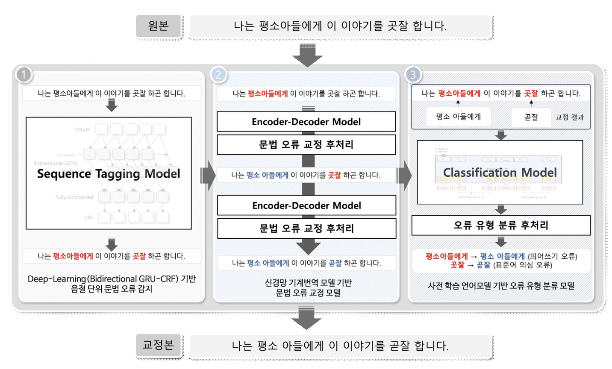

# Pipeline-based Korean Grammatical Error Correction System

딥러닝 기반 파이프라인 한국어 문법 오류 교정 통합 시스템

## 1. 개요

문법 오류 교정(Grammar Error Correction, GEC)은 기존의 규칙 및 통계기반 방법으로 연구가 되었으나 시간과 비용의 한계로 성능 향상에 한계가 존재했다.
이에 최근 연구는 딥러닝 기술을 적용하여 기존 방법의 한계를 보완하였다. 딥러닝 기술을 적용하여 기존 방법의 한계를 보완하였다. 
하지만 기존 딥러닝 기반 문법 오류 교정 모델은 문법 오류 감지와 교정이 동시에 수행되어 문법 오류가 없는 문장을 똑같이 복사하는 비효일성을 발생시키고 수정된 결과에 대해서 명확한 설명을 도출하지 못하는 한계가 존재한다.
따라서 본 연구에서 효과적으로 문법 오류를 교정하고 이용자들에게 결과에 대해 설명할 수 있는 딥러닝 기반 문법 오류 교정 시스템을 제안하였습니다.
이와 관련된 논문은 [여기서](http://riss4u.net/search/detail/DetailView.do?p_mat_type=be54d9b8bc7cdb09&control_no=3b1c608011255b07ffe0bdc3ef48d419&keyword=%EC%8B%A0%ED%98%84%ED%98%B8%20%EC%B5%9C%EC%84%B1%ED%95%84) 확인하실 수 있습니다.

## 2. 모델 구조

파이프라인 문법 오류 교정 시스템은 문법 오류 교정 과정을 문법 오류 감지, 문법 오류 수정, 문법 오류 유형 분류로 나누어 3단계로 진행함.



### 2-1. 문법 오류 감지 모델

* 문법 오류 감지 모델은 주어진 문장에서 문법 오류의 존재와 그 위치를 감지하는 역할을 수행함.
* [monologg/KoCharELECTRA](https://github.com/monologg/KoCharELECTRA) 을 파인튜닝하여 모델을 구축함.
* 학습 데이터 샘플
```
{"error": "최소 3달전에 예약하는게 안전빠", "tag": "O O O B-E I-E I-E E-E O B-E I-E I-E I-E E-E O B-E I-E E-E"}
{"error": "ㅋㅋ아 그러시군요! ㅎㅎ", "tag": "B-E I-E I-E E-E O O O O O O O O O"}
{"error": "아 그거 괜찮네요", "tag": "B-E E-E O O O B-E I-E I-E E-E"}
```

### 2-2. 문법 오류 교정 모델

* 문법 오류 교정 모델은 


# 관련 내용 작성 중 입니다.!